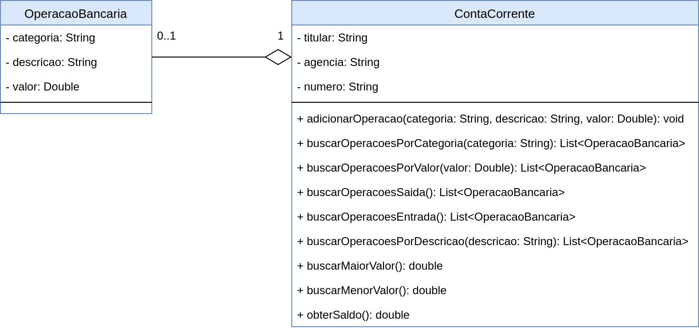

# Exercício Relacionamento 2 📎

## Orientações Gerais: 🚨
1. Utilize **apenas** tipos **wrapper** para criar atributos e métodos.
2. **Respeite** os nomes de atributos e métodos definidos no exercício.
3. Tome **cuidado** com os **argumentos** especificados no exercício.
   **Não** adicione argumentos não solicitados e mantenha a ordem definida no enunciado.
4. Verifique se **não** há **erros de compilação** no projeto antes de enviar.
5. As classes devem seguir as regras de encapsulamento.
6. Deixe um **construtor vazio** para utilização nos testes unitários.

## Conta Corrente 

Abra o projeto de exemplo e implemente as classes OperacaoBancaria e ContaCorrente da
seguinte forma:

Métodos:

* adicionarOperacao
  * Deve validar se a categoria ou a descrição estão nulas, ou possuem apenas caracteres em branco. 
  * Deve também validar se o valor da operação é nulo ou diferente de 0.
  * Caso a operação seja válida deve adicionar na lista de operações.

* buscarOperacoesPorCategoria 
  * Deve buscar todas as operações já realizadas com uma determinada categoria, ignorando letras maiúsculas e minúsculas.
  * Caso não encontre devolva uma lista vazia.

* buscarOperacoesPorValor
  * Deve buscar todas as operações já realizadas com um determinado valor. 
  * Caso não encontre devolva uma lista vazia.

* buscarOperacoesSaida 
  * Deve buscar todas as operações de saída, ou seja, que possuem valor negativo.
  * Caso não encontre devolva uma lista vazia.

* buscarOperacoesEntrada
  * Deve buscar todas as operações de entrada, ou seja, que possuem valor positivo.
  * Caso não encontre devolva uma lista vazia.

* buscarOperacoesPorDescricao
  * Deve buscar todas as operações que contém uma determinada descrição.
  * Para facilitar a busca o método deve permitir que a busca seja realizada com apenas uma parte da descrição para que o usuário não precise digitar a
    descrição completa da operação.
  * Também ignore letras maiúsculas e minúsculas. Caso não encontre devolva uma lista vazia.

* buscarMaiorValor
  * Deve buscar o maior valor entre todas as operações realizadas na conta bancária. 
  * Caso a lista esteja vazia retorne 0.
  
    
* buscarMenorValor 
  * Deve buscar o menor valor entre todas as operações realizadas na conta bancária. 
  * Caso a lista esteja vazia retorne 0.

* obterSaldo
  * Deve retornar o saldo final da conta após a realização de todas as operações.
  * Caso a lista esteja vazia retorne 0.
