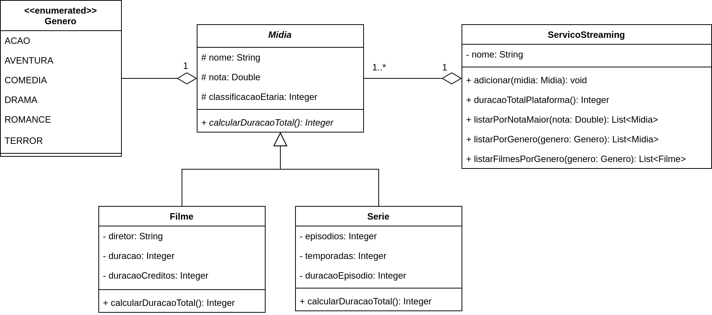

# Avaliação Continuada 03 - Prática 📎

## Orientações Gerais: 🚨
1. Utilize **apenas** tipos **wrapper** para criar atributos e métodos.
2. **Respeite** os nomes de atributos e métodos definidos no exercício.
3. Tome **cuidado** com os **argumentos** especificados no exercício.
   **Não** adicione argumentos não solicitados e mantenha a ordem definida no enunciado.
4. Verifique se **não** há **erros de compilação** no projeto antes de enviar.
5. As classes devem seguir as regras de encapsulamento.
6. Deixe um **construtor vazio** para utilização nos testes unitários.

## Case: Streaming 🎥

Olá caro desenvolvedor,

Você foi contratado para desenvolver um sistema que irá catalogar diversos filmes e séries de diferentes serviços de streaming.

Aqui está a especificação das classes do sistema:

### Métodos da classe `Mídia`:

* `calcularDuracaoTotal`:
  * método abstrato que deve ser implementado nas classes filhas.

### Métodos da classe `Filme`:

* `calcularDuracaoTotal`:
  * deve retornar a duração do filme com créditos.

### Métodos da classe `Serie`:

* `calcularDuracaoTotal`:
  * deve retornar a duração total da série (duração de todos os episódios).

### Métodos da classe `ServicoStreaming`:

* `adicionarMidia`:
  * deve adicionar uma mídia ao serviço de streaming.

* `duracaoTotalPlataforma`:
  * deve retornar a duração total de todas as mídias cadastradas no serviço de streaming.

* `listarPorNotaMaior`:
  * deve retornar uma lista com todas as mídias que possuem nota maior que a nota passada como argumento.

* `listarPorGenero`:
  * deve retornar uma lista com todas as mídias que possuem o gênero passado como argumento.

* `listarFilmesPorGenero`:
  * deve retornar uma lista com todos os filmes que possuem o gênero passado como argumento.

### Boa sorte! 🚀
