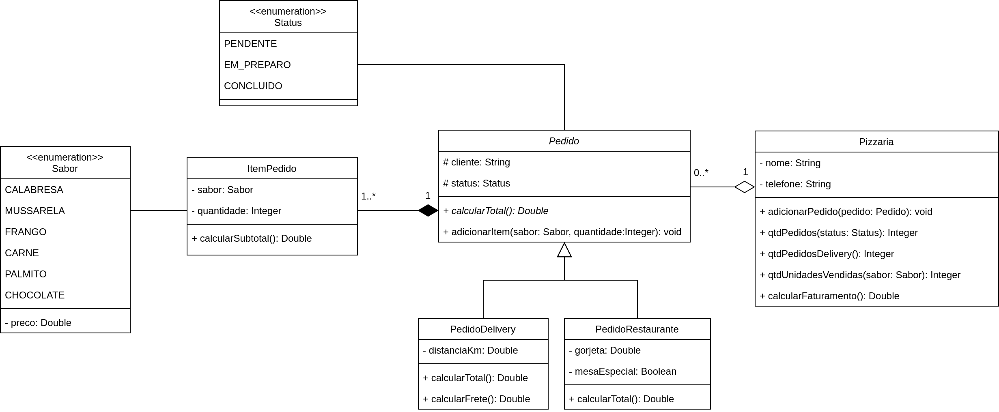

# Exercício - Enumeradores

## Orientações Gerais: 🚨
1. Utilize **apenas** tipos **wrapper** para criar atributos e métodos.
2. **Respeite** os nomes de atributos e métodos definidos no exercício.
3. Tome **cuidado** com os **argumentos** especificados no exercício.
   **Não** adicione argumentos não solicitados e mantenha a ordem definida no enunciado.
4. Verifique se **não** há **erros de compilação** no projeto antes de enviar.
5. As classes devem seguir as regras de encapsulamento.
6. Deixe sempre um **construtor vazio** para utilização nos testes unitários.

## Exercício - Pizzaria 🍕

### Métodos da classe `Pedido`:

* `calcularTotal`:
  * método **abstrato** que deve ser implementado nas classes filhas.

* `adicionarItem`:
  * **recebe** o sabor e quantidade do item a ser adicionado.
  * **adiciona** o item ao pedido.

### Métodos da classe `PedidoDelivery`:

* `calcularTotal`:
  * **calcula** o total do pedido com base nos itens adicionados mais frete.
  * **retorna** o valor total do pedido.

* `calcularFrete`:
  * **calcula** o valor do frete com base na distância em km.
  * regras:
    * abaixo de 5 km: R$ 5,00
    * igual ou acima de 5 km e abaixo de 10 km: R$ 7,00
    * igual ou acima de 10 km: R$ 10,00

### Métodos da classe `PedidoRestaurante`:

* `calcularTotal`:
  * **calcula** o total do pedido com base nos itens adicionados mais gorjeta.
  * caso o pedido inclua a mesa especial adicione mais R$ 20,00 ao total do pedido.

### Métodos da class `ItemPedido`:

* `calcularSubtotal`:
  * **calcula** o subtotal do item com base no sabor e quantidade.
  * **retorna** o valor do subtotal.

### Métodos da classe `Pizzaria`:

* `adicionarPedido`:
  * **recebe** um pedido e o adiciona à lista de pedidos da pizzaria.

* `qtdPedidos`:
  * **recebe** um status que pode ser "PENDENTE", "EM PREPARO" ou "CONCLUIDO".
  * **retorna** a quantidade de pedidos realizados na pizzaria segundo o status informado.

* `qtdPedidosDelivery`:
  * **retorna** a quantidade de pedidos de delivery realizados na pizzaria.

* `qtdUnidadesVendidas`:
  * **recebe** um sabor e **retorna** a quantidade total de unidades vendidas do sabor informado.

* `calcularFaturamento`:
  * **retorna** o faturamento total da pizzaria.
  * o faturamento é a soma de todos os pedidos realizados.
  * considere apenas os pedidos concluídos.

### Enum `Sabor`:
  * Tabela de preços:
    * **CALABRESA**: R$ 35,00
    * **MUSSARELA**: R$ 30,00
    * **FRANGO**: R$ 35,00
    * **CARNE**: R$ 40,00
    * **PALMITO**: R$ 40,00
    * **CHOCOLATE**: R$ 50,00
