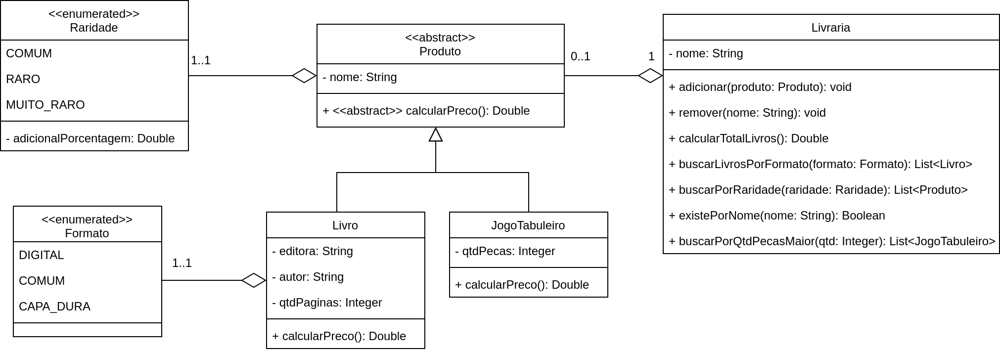

# Exercício - Classe Abstrata e Enumeradores

## Orientações Gerais: 🚨
1. Utilize **apenas** tipos **wrapper** para criar atributos e métodos.
2. **Respeite** os nomes de atributos e métodos definidos no exercício.
3. Tome **cuidado** com os **argumentos** especificados no exercício.
   **Não** adicione argumentos não solicitados e mantenha a ordem definida no enunciado.
4. Verifique se **não** há **erros de compilação** no projeto antes de enviar.
5. As classes devem seguir as regras de encapsulamento.
6. Deixe sempre um **construtor vazio** para utilização nos testes unitários.

## Exercício - Livraria 📚

### Métodos da classe `Produto`:

* `calcularPreco`:
  * método **abstrato** que deve ser implementado nas classes filhas.

### Métodos da classe `Livro`:

* `calcularPreco`:
  * o cálculo do preço do livro deve ser feito da seguinte forma:
    * se o livro for **DIGITAL**, o preço é igual à quantidade de páginas multiplicado por 0,20.
    * se o livro for **COMUM**, o preço é igual à quantidade de páginas multiplicado por 0,30.
    * se o livro for **CAPA_DURA**, o preço é igual à quantidade de páginas multiplicado por 0,40.
  * Considere também o adicional de **raridade** do Produto.

### Métodos da classe `JogoTabuleiro`:

* `calcularPreco`:
  * o preço é igual à quantidade de peças multiplicado por 0,50.
  * Considere também o adicional de **raridade** do Produto.

### Métodos da classe `Livraria`:

* `adicionarProduto`:
  * deve adicionar um produto na lista de produtos da livraria.

* `remover`:
  * deve remover um produto da lista de produtos da livraria pelo nome.

* `calcularTotalLivros`:
  * deve calcular o preço total de todos os livros da livraria.

* `buscarLivrosPorFormato`:
  * deve retornar uma lista com os livros que possuem o formato passado como argumento.

* `buscarPorRaridade`:
  * deve retornar uma lista com os produtos que possuem a raridade passada como argumento.

* `existePorNome`:
  * deve retornar `true` se existir um produto com o nome passado como argumento.

* `buscarPorQtdPecasMaior`:
  * deve retornar uma lista com os jogos de tabuleiro que possuem quantidade de peças maior que a passada como argumento.

### Enum `Raridade`:

* tabela de raridade dos produtos:
  * **COMUM** - 0,0
  * **RARO** - 10,0
  * **MUITO_RARO** - 20,0
