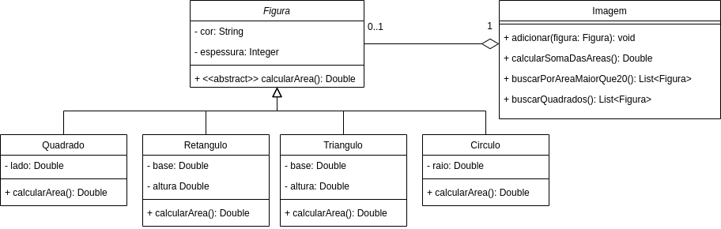

# Exercício - Classe Abstrata 📎

## Orientações Gerais: 🚨
1. Utilize **apenas** tipos **wrapper** para criar atributos e métodos.
2. **Respeite** os nomes de atributos e métodos definidos no exercício.
3. Tome **cuidado** com os **argumentos** especificados no exercício.
   **Não** adicione argumentos não solicitados e mantenha a ordem definida no enunciado.
4. Verifique se **não** há **erros de compilação** no projeto antes de enviar.
5. As classes devem seguir as regras de encapsulamento.
6. Deixe um **construtor vazio** para utilização nos testes unitários.

## Exercício - Figura

Implemente o seguinte diagrama de classes:

### Métodos da classe `Figura`:

* `calcularArea`:
  * método **abstrato** que deve ser implementado nas classes filhas.

* `toString`:
  * método que retorna uma `String` com as informações do objeto.

### Métodos da classe `Quadrado`:

* `calcularArea`:
  * método que **retorna** a área do quadrado.
  * a área do quadrado é calculada multiplicando o lado por ele mesmo.

* `toString`:
  * método que retorna uma `String` com as informações do objeto.

### Métodos da classe `Retangulo`:

* `calcularArea`:
  * método que **retorna** a área do retângulo.
  * a área do retângulo é calculada multiplicando a base pela altura.

* `toString`:
  * método que retorna uma `String` com as informações do objeto.

### Métodos da classe `Triangulo`:

* `calcularArea`:
  * método que **retorna** a área do triângulo.
  * a área do triângulo é calculada multiplicando a base pela altura e dividindo por 2.

* `toString`:
  * método que retorna uma `String` com as informações do objeto.

### Métodos da classe `Circulo`:

* `calcularArea`:
  * método que **retorna** a área do círculo.
  * a área do círculo é calculada multiplicando o raio por ele mesmo e multiplicando por `π` (`Math.PI`).

* `toString`:
  * método que retorna uma `String` com as informações do objeto.

### Métodos da classe `Imagem`:

* `adicionar`:
   * método que **adiciona** uma figura na lista de figuras.
   * o método deve receber uma figura e adicionar na lista de figuras.

* `calcularSomaDasAreas`:
  * método que **retorna** a soma das áreas de todas as figuras.
  * a soma das áreas é calculada somando a área de cada figura.

* `buscarPorAreaMaiorQue20`:
  * método que **retorna** uma lista com as figuras que possuem área maior que 20.

* `buscarQuadrados`:
  * método que **retorna** uma lista com os quadrados da lista de figuras.