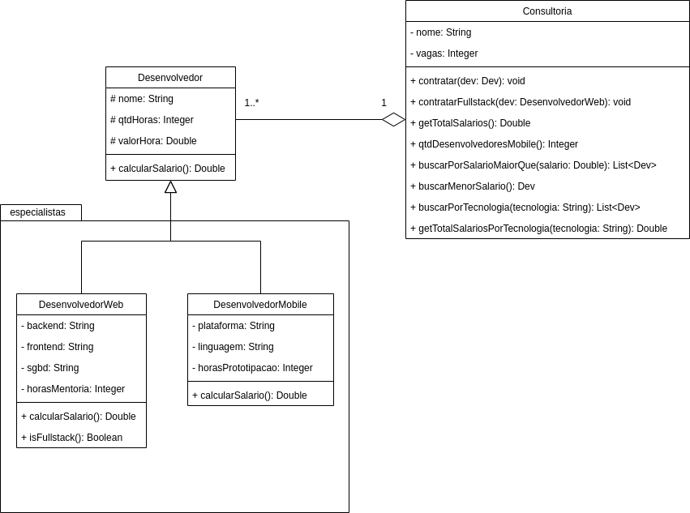

# Exercício - Herança com agregação 📎

## Orientações Gerais: 🚨
1. Utilize **apenas** tipos **wrapper** para criar atributos e métodos.
2. **Respeite** os nomes de atributos e métodos definidos no exercício.
3. Tome **cuidado** com os **argumentos** especificados no exercício.
   **Não** adicione argumentos não solicitados e mantenha a ordem definida no enunciado.
4. Verifique se **não** há **erros de compilação** no projeto antes de enviar.
5. As classes devem seguir as regras de encapsulamento.
6. Deixe um **construtor vazio** para utilização nos testes unitários.

## Exercício - Desenvolvedor 🚩

Implemente o seguinte diagrama de classes:

Métodos da classe `Dev`:

* calcularSalario:
  * calcula o salário do dev conforme os atributos **qtdHoras** e **valorHora**.

Métodos da classe `DesenvolvedorWeb`:

* calcularSalario:
  * calcula o salário do dev conforme os atributos **qtdHoras** e **valorHora** mais as horas de mentoria que valem R$ 300,00 a hora.

* isFullstack:
  * **retorna** se o desenvolvedor é fullstack, ou seja, os atributos **backend**, **frontend** e **sgbd** estão diferentes de null.

Métodos da classe `DesenvolvedorMobile`:

* calcularSalario:
  * calcula o salário do dev conforme os atributos **qtdHoras** e **valorHora** mais as horas de prototipação que valem R$ 200,00 a hora.

Métodos da classe `Consultoria`:

* contratar:
  * deve adicionar o desenvolvedor na consultoria caso hajam vagas disponíveis.
  * a quantidade de vagas não deve ser alterada no processo
  * para saber se há vagas disponíveis faça o cálculo conforme a quantidade de devs contratados e quantidade de vagas totais da consultoria 

* contratarFullstack:
  * deve adicionar o desenvolvedor na consultoria conforme as mesmas regras do método `contratar`
  * deve validar se o desenvolvedor realmente é fullstack conforme as regras do método `isFullstack` da classe `DesenvolvedorWeb`

* getTotalSalario:
  * **retorna** a soma de todos os salários de todos os desenvolvedores da consultoria.

* qtdDesenvolvedoresMobile:
  * **retorna** o total de desenvolvedores mobile da consultoria

* buscarPorSalarioMaiorQue:
  * **retorna** todos os desenvolvedores que possuem o salário maior ou igual ao valor passado como argumento

* buscarMenorSalario:
  * **retorna** o desenvolvedor com menor salário entre todos da consultoria.
  * caso a lista esteja vazia deve retornar null.

### Desafio:

* buscarPorTecnologia:
  * **retorna** o desenvolvedor encontrado conforme a tecnologia passada como argumento.
  * a busca pode ser realizada por tecnologias **frontend**, **backend**, **sgbd**, **plataforma** ou **linguagem**
  * se qualquer uma das tecnologias corresponder ao valor informado retorne o desenvolvedor na lista de resposta

* getTotalSalariosPorTecnologia:
  * **retorna** a soma dos salários dos desenvolvedores encontrados com a tecnologia especificada.