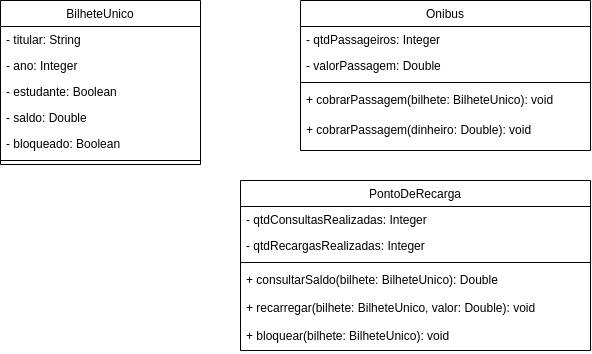

# Exercício - Encapsulamento e UML 📎

## Orientações Gerais: 🚨
1. Utilize **apenas** tipos **wrapper** para criar atributos e métodos.
2. **Respeite** os nomes de atributos e métodos definidos no exercício.
3. Tome **cuidado** com os **argumentos** especificados no exercício.
   **Não** adicione argumentos não solicitados e mantenha a ordem definida no enunciado.
4. Verifique se **não** há **erros de compilação** no projeto antes de enviar.
5. As classes devem seguir as regras de encapsulamento.
6. Deixe um **construtor vazio** para utilização nos testes unitários.

## Exercício - Bilhete Único 🚩

Implemente o seguinte diagrama de classes:

Métodos da classe `BilheteUnico`:

* getters e setters

Métodos da classe `Onibus`:

* cobrarPassagem(bilhete: BilheteUnico)
  * verifica se o bilhete está bloqueado e caso esteja exibe a mensagem
    "bilhete único bloqueado"
  * verifica se existe saldo o suficiente no bilhete e caso não exista, 
  exibe a mensagem "Não há saldo suficiente para realizar a operação"
  * atualiza o valor do **saldo** do bilhete
  * estudantes pagam metade do valor da passagem
  * atualiza o atributo **qtdPassageiros**

* cobrarPassagem(dinheiro: Double)
  * verifica se o valor em **dinheiro** fornecido é suficiente para pagar a passagem e caso 
  não seja exibe a mensagem "Dinheiro insuficiente para realizar operação"
  * atualiza o atributo **qtdPassageiros**

* getters

Métodos da classe `PontoDeRecarga`:

* consultarSaldo(bilhete: BilheteUnico)
  * verifica se o bilhete está bloqueado e caso esteja exibe a mensagem
    "bilhete único bloqueado", retorna 0 e não atualiza o atributo qtdConsultasRealizadas
  * atualiza o atributo **qtdConsultasRealizadas**
  * **retorna** o valor atual de saldo do bilhete

* recarregar(bilhete: BilheteUnico, valor: Double)
  * verifica se o valor de recarga é de pelo menos R$ 5,00 (Valor mínimo) e caso não seja
  exibe a mensagem "Valor mínimo de recarga não atingido"
  * verifica se o bilhete está bloqueado e caso esteja exibe a mensagem
  "bilhete único bloqueado"
  * atualiza o valor do **saldo** do bilhete adicionando o valor da recarga
  * atualiza o atributo **qtdRecargasRealizadas**

* bloquear(bilhete: BilheteUnico)
  * atualiza o atributo **bloquado** do bilhete único

* getters
